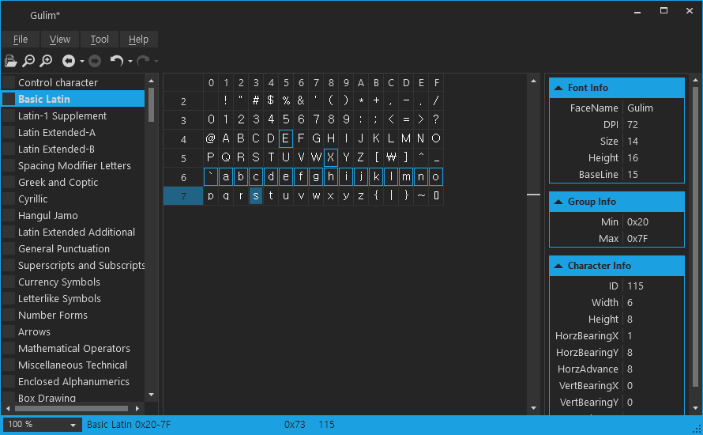

# 개요

FreeType 기반 폰트 텍스쳐 생성기

# 도구

    Microsoft Visual Studio Community 2019
    .NET Framework 4.7.2

    또는

    Microsoft Visual Studio Code
    .NET Core 3.1

# 빌드 및 실행

## Visual Studio Community 2019

    Window Key + S 누른후 검색창에서 Developer PowerShell For VS 2019 실행

    git clone https://github.com/s2quake/JSSoft.Font.git --recursive

    cd JSSoft.Font

    msbuild -t:restore 

    msbuild -t:build -p:configuration=Release

    .\bin\Release\jsfontApp.exe

## Visual Studio Code

    git clone https://github.com/s2quake/JSSoft.Font.git --recursive

    cd JSSoft.Font

    dotnet restore

    dotnet build --framework netcoreapp3.0

    dotnet run --framework netcoreapp3.0 --project JSSoft.Font.ApplicationHost
